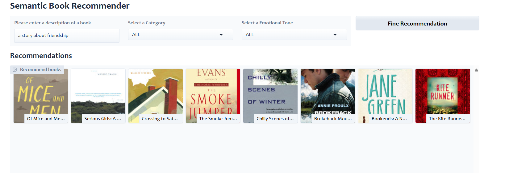

# Book_recommendation_app
An app to recommend books

The Book Recommender System is a user-friendly application designed to recommend books based on a user's query emotion and category. Built with Gradio and Python, this tool provides an intuitive interface for users to input their preferences and receive personalized book recommendations instantly. The system is lightweight, easy to use, and does not require complex ML-Ops pipelines, making it ideal for quick deployment and experimentation.

## How It Works

The application uses a pre-trained or custom-trained model to generate book recommendations based on two key inputs:

- Emotion: The user's current mood or emotional state (e.g., happy, sad, adventurous).

- Category: The genre or category of books the user is interested in (e.g., fiction, non-fiction, mystery).

The system processes these inputs and returns a list of recommended books tailored to the user's preferences.

## Features

- Simple and Intuitive Interface: Built with Gradio, the app provides an easy-to-use interface for users to input their preferences and view recommendations.

- Real-Time Recommendations: Generates book recommendations instantly based on the user's inputs.

## Installation

Follow these steps to set up the Book Recommender System on your local machine.

### Prerequisites

- Python 3.10

### Steps

#### Clone the Repository
    git clone https://github.com/your-username/Book_recommendation_app.git
  
#### Navigate to the Project Directory
    cd book-recommender-system
#### Create a Virtual Environment
    python -m venv venv
    source venv/bin/activate  # On Windows, use `venv\Scripts\activate`
#### Install Dependencies
    pip install -r requirements.txt
#### Run the Application
    python gradio-dashboard.py
#### Access the Tool
Open your browser and navigate to link.

## Usage

### Input Emotion and Category

Enter your current emotion (e.g., happy, sad, Suspensful) in the "Emotion" field.

Enter your preferred book category (e.g., fiction, non-fiction, nature) in the "Category" field.

    
    
<em>Book Recommender</em>

### Generate Recommendations:

Click the Find Recommendation button to process your inputs and generate a list of recommended books.

### View Results:

The recommended books will be displayed in the output box.

## Technologies Used

<b>Python:</b> The core programming language used for the backend logic.

<b>Gradio:</b> A lightweight library for creating user-friendly interfaces for machine learning models.

<b>Pre-trained Models:</b> Utilizes a pre-trained model to classify emotions based on the description of the book.

<b>Generative-AI Model:</b> Utilized an Openai model to give recommendtations based on the query given. 

<b>Pandas/Numpy:</b> For data manipulation and processing.

## Enjoy Recommending Books

With the Book Recommender System, you can easily discover books that match your mood and interests. Whether you're feeling adventurous, reflective, or curious, this tool has you covered! 🚀

